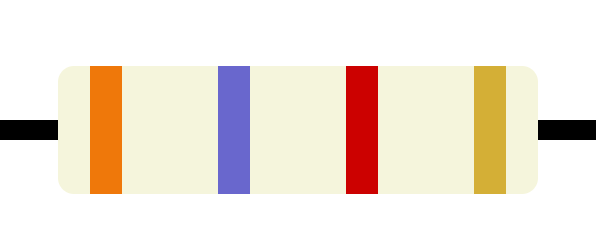

# Resistor Calculator

## Overview

The Resistor Calculator is a web application that helps electrical engineers and hobbyists calculate the resistance value of a resistor based on the color bands printed on it. This project provides an interface where users can select the colors of the bands using interactive color boxes, and the application calculates and displays the resistance value in Ohms with tolerance calculated too.

The calculator is implemented using HTML, CSS, and JavaScript. It utilizes the principles of color coding for resistors, where each color represents a numerical value, and the combination of colors determines the resistance value and tolerance for the resistor.

## Features

- Interactive color selection: Users can select the colors of the bands by clicking on color boxes.
- Real-time calculation: The resistance value is calculated as the user selects the color bands.
- Display of resistance value: The calculated resistance value is displayed on the screen along with the tolerance percentage.
- Very Easy to use: The inteface is designed to be intuitive and user-friendly, making it accessible for both beginners and experienced engineers.
